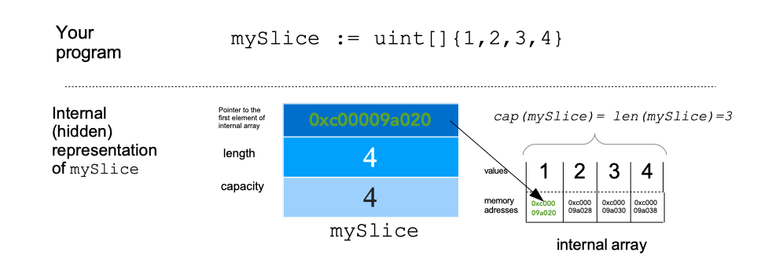

# Go Basics

## Overview of Topics:
* [What is Go?](#what-is-go)
* [Compile and run Go program](#compile-and-run-go-program)
* [Basic hello world program](#basic-hello-world-program)
* [Data Types](#data-types)
* [Variables](#variables)
* [Control Structures](#control-structures)
* [Functions](#functions)
* [Structs](#structs)

## What is Go?
* Programming language invented at Google
* Characteristics
  * Static typing
  * Compiled language
  * **Concurrency support**. Golang does this through `goroutines` and channels. Goroutines are the functions/methods 
  that run concurrently with other functions or methods. Memory optimized. Channels facilitate communication between goroutines
  * Robust standard libraries for I/O, text processing graphics, networking, etc

* Overall, Provide the basics well without all the added complexity hell of classes, inheritance, bloat, etc

## Compile and Run Go program
* Produce compiled file: `go build <filename>.go` (eg: `go build helloworld.go` produces a compiled binary of `helloworld` that's executable). You can run the executable using `./helloworld`. Use this for re-running the same binary every time with no unexpected changes
* `go run <filename>.go` (eg: `go run helloworld.go`) builds the compiled binary, runs it and then removes the compiled binary.

## Basic Hello World program
> Look at `basics/helloworld.go]` for the code. We have this snippet
```go
package main

import "fmt"

func main() {
	fmt.Println("Hello World")
}
```
* Package declarations are either executables (meant to be run) or libraries (other `*.go` files import them). `package main` is a special package that defines an executable program. `package main` looks for a `func main()` for running the program. 
* If I changed the package declaration in the go code above to `package hello`, then this file will be compiled as a library instead of an executable
* You have to import ONLY the packages you need otherwise you get a compilation error. This is to prevent unused packages from accumulating as the program evolves

### Good tools to have
* `gofmt` to auto format the source code to Go's standards. You can run a command like `gofmt -w helloworld.go`
* `goimports` to automanage the imports and keep only what's needed. Install [here](https://pkg.go.dev/golang.org/x/tools/cmd/goimports) using the terminal command
* `go doc` to lookup documentation of a function in go. Eg: for the `Println` function, you can run `go doc fmt Println`

## Data Types

> Look at `basics/data-types/data-type-operations.go`

* Integers: you have `uint8`, `uint16`, `uint32`, `uint64`, `int8`, `int16`, `int32`, and `int64`. For example, `uint16` means unsigned 16 bit integer
  * The alias types (more common) are `byte` (for `uint8`), `rune` (same as `int32`). `int` is signed integer and you use this for the most part. This is machine dependent based on the architecture
* Floating point numbers: `float32` or `float64`. You can use `complex64` and `complex128` for imaginary numbers. Most of the time, use `float64`
* Arithmetic: add, subtract, multiply, divide, modulo
* Strings: Create with double quote or backticks. Double quoted strings don't contain newlines but you can use `\n` and `\t` as escape characters
* Booleans: True/False. `&&` is logical AND, `||` is logical OR, `!` is logical NOT


## Variables
> Look at `variables/variables.go` for the sample code

* Variable is just a memory address for storing a value. We specify type and name

Example Declaration:
```go
var x string
x = "Hello, World"
fmt.Println(x)
```

As you may guess `x` is name of variable. It's of type string and we assign it the value of `"Hello, World"`

The preferred way is through this shorthand
```go
x := "Hello, World"
fmt.Println(x)
```
Here, we see that variable `x` is assigned value of `"Hello, World"`. Go compiler autoinfers the type

Use camel case for naming variables in go

**NOTE:** "Go is lexically scoped using blocks". That means if you declare a variable in a function, the variable's scope is that function. Here's an example

```go
var x string = "Hello, World"

func main() {
    fmt.Println(x)
}

func f() {
    fmt.Println(x)
}
```
The `x` variable here can be used in both `main()` and `f()` functions

```go
func main() {
    var x string = "Hello, World"
    fmt.Println(x)
}

func f() {
    fmt.Println(x)
}
```
However, we will get a compilation error in this code when we move `x` into the scope of the `main()` function. Function `f()` can't access `x`

You can also define constants which are variables where we cannot change the value

Use `fmt` library also for parsing input from the terminal. See `variables/double_number.go` for a sample script


## Control Structures
> Check out the files in `basics/control-structures`
* If / else if / else statements work like other programming languages

```go
x := 10
if (x > 10) {
    fmt.Println("Big Number")
} else {
    fmt.Println("Small Number")
}
```

If you have multiple cases, you can use switch statement like shown below. Fall back to `default` if provided

```go
x := 10 % 3
switch x {
    case 0:
      fmt.Println("divisible by 3")
    case 1: 
      fmt.Println("remainder 1 when divided by 3")
    case 2:
      fmt.Println("remainder 2 when divided by 3")
    default:
      fmt.Println("Invalid number")
}
```

Sample loop:

```go
i := 1
for i <= 10 {
    fmt.Println(i)
    i = i + 1
}
```

Alternative way to the above (should look similar to Java)
```go
for i := 1; i <= 10; i++ {
    fmt.Println(i)
}
```

## Arrays, Slices, Maps
Some key built-in data structures are arrays, slices, and maps

### Arrays
> See the files in `basics/arrays-slices-maps/average_grade.go`
- Sequence of elements with **FIXED** length

```go
var x [5]int // array of integers with 5 elements as length

x[4] = 100 //at index 4 (0-indexed), assign to element 100

fmt.Println(x) //[0, 0, 0, 0, 100]

fmt.Println(len(x)) // length of array (like string)
```

### Slices

> Check `basics/arrays-slices-maps/slices.go`

Slices are segments of array. Slices are indexable and have a length. Arrays in Go cannot change length, but slices allow for length to change

```go
x := make([]float64, 5) // create a slice with underlying float64 array of length 5
X := make([]float64, 5, 10) // create a slice with underlying float64 array of length 5 with capacity 10
```


Key functions for slice:
* Extract subsection of array and that's a slice
* `append`: Add element at end of slice. If there is sufficient capacity, add to same array. If not, new array created and elements copied over. NEW reference is returned
* `copy`: Takes in two arguments `dst` and `src`. All entries in `src` are copied into `dst` OVERWRITING what's there. If lengths of the two slices are not the same, the smaller of the two will be used

```go

func main() {
  slice1 := []int{1, 2, 3}
  slice2 := append(slice1, 4, 5)
  fmt.Println(slice1, slice2) // [1, 2, 3] in slice 1, but [1, 2, 3, 4, 5] in slice 2
}
```

Underlying data representation of a slice:
* Header containing the ptr to the memory address of the first element of the underlying array
* current length of array
* capacity of array



### Maps
> Check out `basics/arrays-slices-maps/maps.go`
Map is UNORDERED collection of key/value pairs. AKA the hashmap in Java

WRONG WAY:
```go
var x map[string]int // x is a map of strings to ints
x["key"] = 10 // set an entry in map
fmt.Println(x) //run time error. You have to initialize the map :)
```

RIGHT WAY:
```go
x := make(map[string]int)
x["key"] = 10
fmt.Println(x["key"])
```

A shorthand (use this way more often) to initialize map is 

```go
elements := map[string][int]{"key": 10}
```

## Functions
* In the previous modules, we've been working in the `main()` function. We should be able to write our own functions

Sample placeholder function
```go
func average(xs []float64) float64 {
  panic("Not Implemented")
}
```

notice the similarity to Java
```java
public double average(double[] xs) {
  throw new Exception("Not Implemented")
}
```

* All functions in go use `func` keyword and in parameters, you define using the `name type, name type` format
* Return type of function is after the parameter specifications and that completes the function signature

### Variadic Functions
* Special form available for the last parameter in a Go function:

```go
func add(args ...int) int {
  total := 0
  for _, v := range args {
    total += v
  }
  return total
}

func main() {
  fmt.Println(add(1,2,3))
  // passing in a slice
  xs := []int{1, 2, 3}
  fmt.Println(add(xs...))
}
```
See here that `add` func can be called with multiple integers. This is the "variadic parameter". 

The ellipsis before the type name of the last parameter, you can indicate that it takes 0 or more parameters

Here, we can pass as many ints as we want. We can pass in slice to variadic function with ellipsis

### Closures
> Check out `basics/functions/closures.go`
* Just like Python, you can create functions inside of functions

```go
func main() {
  add := func(x, y int) int {
    return x + y
  }
  fmt.Println(add(1, 1))
}
```

Here `add` is a local variable that has type `func(int, int) int`. This `add` function will have access to other local variables

```go
func main() {
  x := 0
  increment := func () int {
    x++
    return x
  }
  fmt.Println(increment())
  fmt.Println(increment())
}
```

### defer
`defer` is a statement that allows Go to schedule a function call to be run after function completes. 

```go
func first() {
  fmt.Println("1st")
}
func second() {
  fmt.Println("2nd")
}

func main() {
  defer second()
  first()
}
```
The above program prints `1st` followed by `2nd`. Defer moves the call to `second` at the end of the functoin

**You'll often use defer to free up resouces in some way such as "closing file" after reading the file**

Defer is run EVEN when panic occurs

### panic and recover
> Check out `basics/functions/panic.go`
* panic introduces runtime error. We can handle a runtime panic with a built in `recover` function

```go
package main

import "fmt"

func main() {
  defer func() {
    str := recover()
    fmt.Println(str)
  }
  panic("PANIC") // HAVE to defer the recover so it runs after panic
}
```

Panic generally indicates programmer error (eg: out of bounds index, forget to initialize map) or an exceptional condition where we can't easily recover from (PANIC because "go doesnt know what to do")


### Pointers
> Check out `basics/functions/pointers.go`
* When we call a function that takes an argument, we "pass by value"

```go
func zero(x int) {
  x = 0
}

func main() {
  x := 5
  zero(x)
  fmt.Println(x) // still 5 because we pass the x by VALUE
}
```

Suppose we actually want to modify the `x` var in the `zero` function. We should pass the REFERENCE in instead (AKA the "pointer")

```go
func zero(xPtr *int) {
  *xPtr = 0 // pass in the memory address of x and update the value of it to 0
}

func main() {
  x := 5
  zero(&x) // pass in address of x
  fmt.Println(x)
}
```

* `&` gives pointer! (ie: the reference to memory location)
* `*` dereferences the pointer. You get access to the value the pointer points to

## Structs

